# Jalur B - Database ERD v2 (Normalized, 3NF)

Database: `jalurB` (MySQL). Dokumen ini memuat 35 tabel dan diselaraskan dengan model aplikasi serta seluruh migration sampai revision `e2a9c8f4b6d1`.

Buka **`jalurB-v2.erd`** menggunakan [ERD Editor](https://github.com/dineug/erd-editor) untuk melihat kolom, tipe data, nullability, default, primary key, foreign key, unique constraint, dan index secara visual.

## Konvensi Tipe Data

- Primary key transaksi menggunakan `BIGINT AUTO_INCREMENT`; master data menggunakan `INT AUTO_INCREMENT`.
- UUID aplikasi direpresentasikan sebagai `CHAR(36)`.
- Snapshot terstruktur menggunakan `JSON`.
- Nilai uang menggunakan `DECIMAL(15,2)` dan skor menggunakan `DECIMAL(5,2)`.
- Status dengan himpunan nilai tetap menggunakan `ENUM`.
- Waktu menggunakan `DATETIME` atau `TIMESTAMP` sesuai kebutuhan tabel.

## Mermaid ERD

```mermaid
erDiagram
    users ||--o{ oauth_login_codes : exchanges
    users ||--o{ auth_action_tokens : owns
    users ||--o| user_profiles : has
    users ||--o| user_cvs : confirms
    users ||--o{ cv_confirmation_receipts : confirms

    industries ||--o{ roles : groups
    users ||--o{ user_skills : has
    skills ||--o{ user_skills : referenced_by

    users ||--o{ health_assessments : assesses
    health_assessments ||--o{ health_score_breakdowns : breaks_down

    users ||--o{ risk_scans : scans
    risk_scans ||--o{ risk_factors : detects
    risk_scans ||--o{ risk_scan_skills : uses
    skills ||--o{ risk_scan_skills : referenced_by

    users ||--o{ ai_exposure_assessments : assesses
    ai_exposure_assessments ||--o{ exposed_activities : identifies
    ai_exposure_assessments ||--o{ skill_relevances : rates
    skills ||--o{ skill_relevances : referenced_by
    ai_exposure_assessments ||--o{ ai_exposure_skills : uses
    skills ||--o{ ai_exposure_skills : referenced_by
    ai_exposure_assessments ||--o{ ai_exposure_tools : uses
    tools ||--o{ ai_exposure_tools : referenced_by

    users ||--o{ pivot_analyses : analyzes
    roles o|--o{ pivot_analyses : targets
    pivot_analyses ||--o{ pivot_preferred_roles : recommends
    pivot_analyses ||--o{ pivot_skill_gaps : identifies
    pivot_preferred_roles o|--o{ pivot_skill_gaps : scopes
    skills ||--o{ pivot_skill_gaps : referenced_by

    users ||--o{ evidence_items : owns
    users ||--o{ weekly_career_insights : receives
    users ||--o{ market_baselines : creates
    users o|--o{ market_baselines : approves
    market_baselines ||--o{ market_baseline_signals : contains

    users ||--o| financial_profiles : configures
    users ||--o{ financial_assets : owns
    users ||--o{ runway_calculations : calculates

    users ||--o{ skill_missions : owns
    skills o|--o{ skill_missions : trains
    pivot_skill_gaps o|--o{ skill_missions : originates

    users ||--o{ layoff_simulations : simulates
    pivot_analyses o|--o{ layoff_simulations : provides_best_pivot
    layoff_simulations ||--o{ simulation_action_items : plans
```

`storage_deletion_jobs` tidak memiliki foreign key karena merupakan outbox mandiri untuk retry penghapusan objek storage.

## Kelompok Tabel

| Area | Tabel |
|---|---|
| Akun dan autentikasi | `users`, `oauth_login_codes`, `auth_action_tokens` |
| Profil dan CV | `user_profiles`, `user_cvs`, `cv_confirmation_receipts`, `storage_deletion_jobs` |
| Master data | `industries`, `roles`, `skills`, `tools`, `user_skills` |
| Career Health Score | `health_assessments`, `health_score_breakdowns` |
| Career Risk Scanner | `risk_scans`, `risk_factors`, `risk_scan_skills` |
| AI Exposure | `ai_exposure_assessments`, `exposed_activities`, `skill_relevances`, `ai_exposure_skills`, `ai_exposure_tools` |
| Career Pivot Map | `pivot_analyses`, `pivot_preferred_roles`, `pivot_skill_gaps` |
| Evidence dan insight | `evidence_items`, `weekly_career_insights` |
| Market baseline | `market_baselines`, `market_baseline_signals` |
| Personal Runway | `financial_profiles`, `financial_assets`, `runway_calculations` |
| Skill Missions | `skill_missions` |
| Simulasi PHK | `layoff_simulations`, `simulation_action_items` |

## Constraint Penting

- `users.username`, `users.email`, dan `skills.name` unik tanpa membedakan kapital pada konfigurasi database aplikasi.
- `user_profiles.user_id`, `user_cvs.user_id`, dan `financial_profiles.user_id` unik sehingga relasinya satu-ke-satu dengan `users`.
- `user_skills` unik untuk pasangan `(user_id, skill_id)`; proficiency dibatasi 1-5 dan pengalaman 0-99,9 tahun.
- `health_score_breakdowns` unik untuk pasangan `(assessment_id, dimension)`.
- `cv_confirmation_receipts` unik untuk pasangan `(user_id, preview_id)`.
- `weekly_career_insights` unik untuk pasangan `(user_id, week_start)`.
- `simulation_action_items` unik untuk pasangan `(simulation_id, step_order)`.
- `market_baseline_signals` unik berdasarkan baseline, tipe subjek, nama subjek tanpa membedakan kapital, dan tipe sinyal.
- Hanya satu `market_baselines` berstatus `approved` yang boleh aktif pada satu waktu.
- Nilai finansial tidak boleh negatif, `monthly_essential_expenses` harus lebih dari nol, dan skor readiness dibatasi 0-100.

## Catatan Pemeliharaan

- `jalurB-v2.erd` adalah sumber visual ERD yang aktif.
- Perubahan skema harus dilakukan melalui model dan migration terlebih dahulu, kemudian kedua dokumen ERD ini diperbarui.

